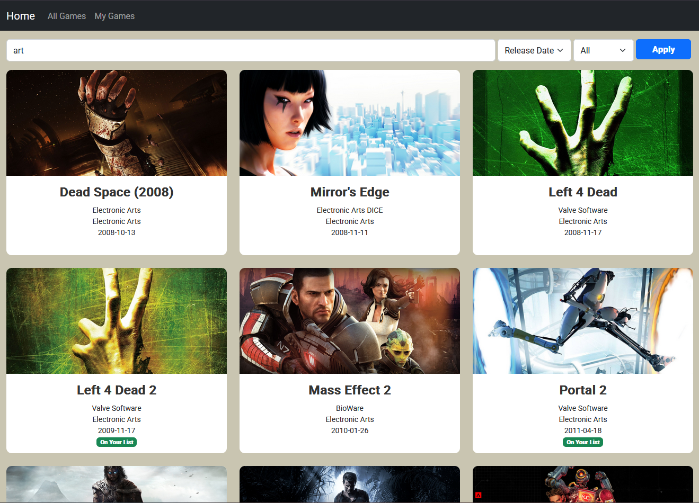
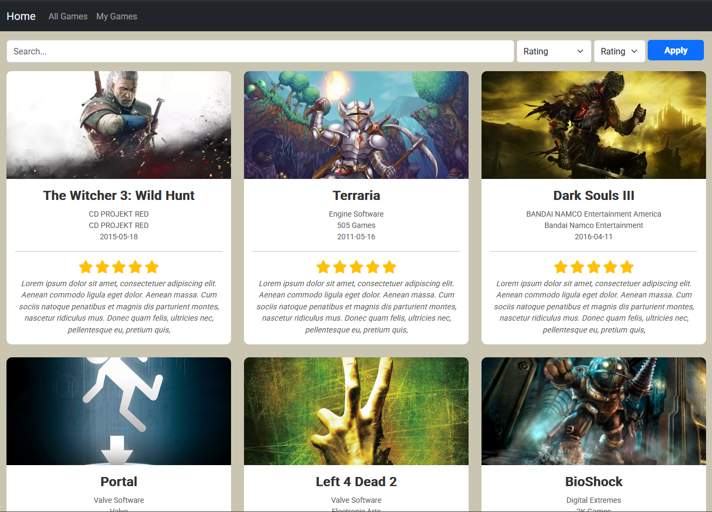
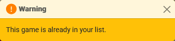

# Game Tracker

A Spring Boot web application that allows users to browse a database of video games and track which games they've completed. Users can add games to their list, rate them, and leave notes.

## Setup

Ensure **Java 17** or higher installed  

#### 1. Clone the repository

```bash
git clone https://github.com/FarisAyub/Gametracker.git
cd Gametracker
```
#### 2. Build project using Maven and run it
```bash
./mvnw clean package
java -jar target/gametracker-1.0.jar
```
#### You should now be able to access the app at http://localhost:8080

## Features

- Browse a database of video games
- Filter, search, and sort games
- Add games to a personal list
- Add ratings and notes to tracked games
- Visual badge indicator for games already in the user’s list
- Toasts for success/error feedback
- Pagination for easier navigation and better performance
- Responsive UI using Bootstrap 5
- Database is populated using games from RAWG API

## Tech Stack

- **Backend:** Java 17, Spring Boot, Spring Data JPA
- **Frontend:** Thymeleaf, Bootstrap 5
- **Database:** H2 file-based (persistent)
- **Testing:** JUnit 5, Mockito, MockMvc
- **Build Tool:** Maven

## Tests

- Integration tests for `/games` and `/user-games` functionality including searching, sorting, and filtering
- Controller unit tests with Mockito and MockMvc
- Exception handling tested via `@ControllerAdvice`
- Test profile uses an isolated test database (`application-test.yml`)

## Configuration

- Uses a persistent H2 file-based database configured in `src/main/resources/application.yml`
- Games are fetched from the RAWG API when the database is empty
- To re-populate the game list, delete the database file and restart the app
- API request logic is defined in: `src/main/java/com/faris/gametracker/service/GameApiService.java`\

## Potential Future Improvements
- User authentication with registration/login
- Dynamic API requests to add specific games, or update the database on demand
- More game details such as platform and genre tags
- Customisable UI, such as dark/light themes

## Screenshots

### All Games View  


### User Game List  


### Toast Notification (Success)  


### Toast Notification (Warning)  


### Toast Notification (Error)  


## License
This project is for educational purposes only and is not intended for commercial use.

## About
Created By: Faris Ayub
